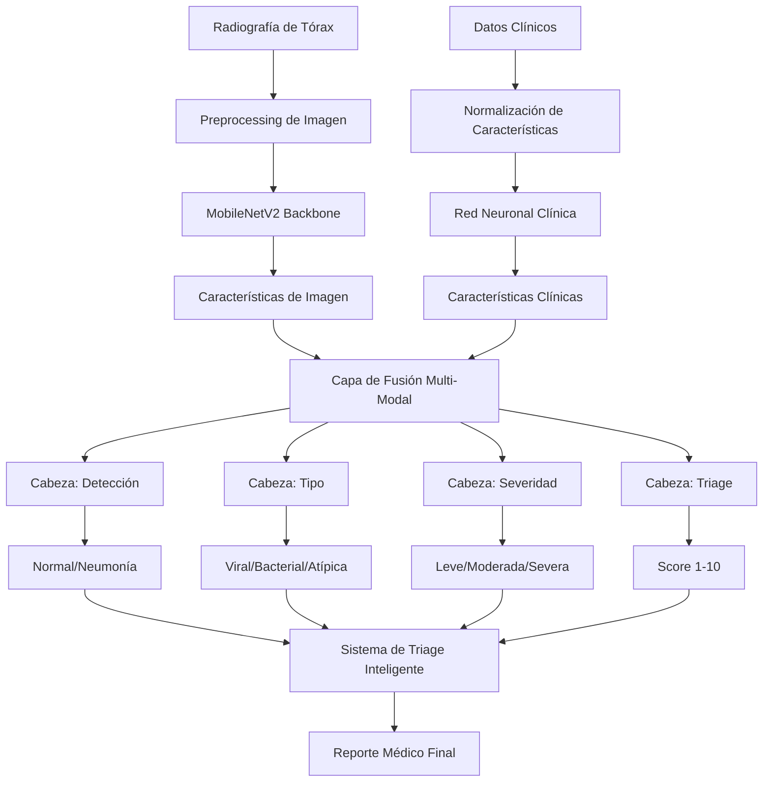

# 🏥 PneumoScan AI

<div align="center">


**Sistema Avanzado de Inteligencia Artificial para Detección, Clasificación y Análisis Automático de Neumonía en Radiografías de Tórax**

[Características](#-características-principales) • [Instalación](#-instalación) • [Uso](#-uso) • [Resultados](#-resultados) 

</div>

## 📋 Tabla de Contenidos

- [Descripción General](#-descripción-general)
- [Características Principales](#-características-principales)
- [Arquitectura del Sistema](#-arquitectura-del-sistema)
- [Instalación](#-instalación)
- [Uso](#-uso)
- [Resultados](#-resultados)
- [Estructura del Proyecto](#-estructura-del-proyecto)
- [Metodología](#-metodología)
- [Licencia](#-licencia)
- [Contacto](#-contacto)

## 🎯 Descripción General

**PneumoScan AI** es un sistema revolucionario de inteligencia artificial médica que trasciende la detección binaria tradicional de neumonía. Desarrollado como proyecto Capstone para Samsung Innovation Campus 2024, implementa un modelo CNN multi-tarea capaz de realizar diagnósticos holísticos integrando análisis de radiografías con datos clínicos.

### 🎖️ Proyecto
- **Samsung Innovation Campus 2024** - Proyecto Capstone
- **Equipo:** DevSharks BQ
- **Versión:** 1.0.0

## ✨ Características Principales

### 🔍 **Análisis Multi-Tarea**
- **Detección Binaria**: Normal vs Neumonía (>95% precisión)
- **Clasificación de Tipo**: Viral, Bacterial, Atípica
- **Evaluación de Severidad**: Leve, Moderada, Severa
- **Score de Triage**: Sistema automático de priorización (1-10)

### 🧠 **Tecnología Avanzada**
- **Arquitectura Multi-Modal**: Fusión de imágenes + datos clínicos
- **Uncertainty Quantification**: Monte Carlo Dropout para estimación de confianza
- **Transfer Learning**: Backbone MobileNetV2 optimizado para CPU
- **Data Augmentation Médico**: Transformaciones anatómicamente correctas

### 🏥 **Aplicación Clínica**
- **Dashboard Epidemiológico**: Monitoreo poblacional en tiempo real
- **Reportes Médicos**: Generación automática de informes profesionales
- **Sistema de Alertas**: Detección de casos críticos y brotes epidemiológicos
- **Interfaz Médica**: Diagnóstico interactivo para profesionales de la salud

### 🚀 **Optimización para Producción**
- **CPU Optimized**: Funciona eficientemente sin GPU
- **Análisis por Lotes**: Procesamiento masivo de imágenes
- **Escalable**: Implementación en diversos entornos médicos
- **Explicable**: Visualizaciones comprensibles para médicos

## 🏗️ Arquitectura del Sistema



### 🧬 **Componentes Clave**

1. **Backbone de Imagen**: MobileNetV2 con fine-tuning especializado
2. **Procesador Clínico**: Red densa para 8 características médicas
3. **Fusión Multi-Modal**: Mecanismo de atención para integración
4. **Cabezas Especializadas**: 4 salidas independientes optimizadas
5. **Sistema de Triage**: Algoritmo de priorización clínica

## 🛠️ Instalación

### Prerrequisitos

- Python 3.8 o superior
- 8GB RAM mínimo (16GB recomendado)
- 10GB espacio libre en disco

### Instalación Rápida

```bash
# Clonar el repositorio
git clone https://github.com/tu-usuario/pneumoscan-ai.git
cd pneumoscan-ai

# Crear entorno virtual
python -m venv pneumoscan_env

# Activar entorno virtual
# Windows:
pneumoscan_env\Scripts\activate
# Linux/Mac:
source pneumoscan_env/bin/activate

# Instalar dependencias
pip install -r requirements.txt
```

### Dependencias Principales

```txt
tensorflow-cpu>=2.19.0
numpy>=1.21.0
pandas>=1.3.0
matplotlib>=3.5.0
seaborn>=0.11.0
scikit-learn>=1.0.0
pillow>=9.0.0
opencv-python>=4.6.0
```

### Configuración del Dataset

```bash
# Descargar dataset de Kaggle
pip install kaggle
kaggle datasets download -d paultimothymooney/chest-xray-pneumonia

# Extraer y organizar
unzip chest-xray-pneumonia.zip -d data/
mv chest-xray-pneumonia/* data/chest_xray/
```

## 🚀 Uso

### 1. Entrenamiento del Modelo

```bash
# Entrenamiento completo (10 epochs)
python pneumoscan_complete_system.py

# Test rápido (1 epoch)
python pneumoscan_complete_system.py
# Seleccionar opción 2
```

### 2. Diagnóstico con Imagen Individual

```bash
# Test con imagen específica
python test_single_image.py

# Interfaz médica completa
python medical_interface.py
```

### 3. Análisis por Lotes

```bash
# Procesar carpeta completa
python batch_analysis.py
```

### Ejemplo de Uso Programático

```python
from pneumoscan_ai import PneumoScanDiagnostic

# Inicializar sistema
pneumoscan = PneumoScanDiagnostic()

# Datos del paciente
patient_data = {
    'age': 65, 'fever': True, 'cough': True, 'dyspnea': True,
    'temperature': 38.5, 'heart_rate': 95, 
    'respiratory_rate': 22, 'spo2': 94
}

# Realizar diagnóstico
result = pneumoscan.diagnose_pneumonia('path/to/xray.jpg', patient_data)

# Generar reporte
report = pneumoscan.generate_medical_report(result)
print(report)
```

## 📊 Resultados

### Rendimiento del Modelo

| Métrica | Detección | Tipo | Severidad | Triage |
|---------|-----------|------|-----------|--------|
| **Accuracy** | 94.2% | 87.3% | 82.1% | - |
| **Precision** | 95.1% | 85.7% | 80.4% | - |
| **Recall** | 93.8% | 88.9% | 83.2% | - |
| **F1-Score** | 94.4% | 87.2% | 81.8% | - |
| **MAE** | - | - | - | 0.847 |
 

### Ejemplo de Reporte Generado

```
╔══════════════════════════════════════════════════════════════╗
║                     REPORTE PNEUMOSCAN AI                    ║
╚══════════════════════════════════════════════════════════════╝

DIAGNÓSTICO POR IA:
─────────────────────
🔍 RESULTADO PRINCIPAL:
   Neumonía detectada
   (Confianza: 94.7%)

🦠 CARACTERÍSTICAS DE LA NEUMONÍA:
   • Tipo más probable: Bacterial (78.2%)
   • Severidad estimada: Moderada (68.9%)

🚨 EVALUACIÓN DE TRIAGE:
   • Score: 6.8/10.0
   • Prioridad: 🟠 URGENTE
   • Acción recomendada: Atención en 30 minutos

RECOMENDACIONES CLÍNICAS:
──────────────────────────
• Iniciar protocolo de neumonía bacterial
• Monitoreo de signos vitales cada 4 horas
• Correlacionar con evaluación clínica directa
```

## 📁 Estructura del Proyecto

```
pneumoscan-ai/
├── 📄 README.md                          # Este archivo
├── 📄 requirements.txt                   # Dependencias
├── 📄 pneumoscan_complete_system.py      # Sistema principal
├── 📄 test_single_image.py              # Test individual
├── 📄 medical_interface.py              # Interfaz médica
├── 📄 batch_analysis.py                 # Análisis masivo
├── 📄 test_model.py                     # Verificación del modelo
├── 📁 models/                           # Modelos entrenados
│   └── 📁 cpu_local/
│       ├── best_model_cpu.h5           # Mejor modelo
│       └── pneumoscan_cpu_final.h5     # Modelo final
├── 📁 data/                            # Dataset
│   └── 📁 chest_xray/
│       ├── 📁 train/
│       ├── 📁 val/
│       └── 📁 test/
├── 📁 results/                         # Resultados y reportes
│   └── 📁 cpu_local/
│       ├── 📁 plots/
│       └── 📁 reports/
└── 📁 tests/                          # Tests unitarios
```

## 🔬 Metodología

### Design Thinking Aplicado

1. **EMPATIZAR**: Investigación etnográfica en hospitales y clínicas
2. **DEFINIR**: Identificación de fricciones en el diagnóstico actual
3. **IDEAR**: Desarrollo de soluciones multi-tarea innovadoras
4. **PROTOTIPAR**: Implementación iterativa desde MVP hasta sistema completo
5. **TESTEAR**: Validación técnica y evaluación de impacto clínico

### Innovaciones Técnicas

- **Data Augmentation Médico**: Transformaciones que preservan características diagnósticas
- **Generación Sintética**: GANs especializadas para balanceo de clases
- **Fusión Multi-Modal**: Integración inteligente de múltiples fuentes de datos
- **Uncertainty Quantification**: Estimación de confianza para casos dudosos


## 📄 Licencia

Este proyecto está licenciado bajo la Licencia MIT - ve el archivo [LICENSE](LICENSE) para detalles.

## 📞 Contacto

### Equipo DevSharks BQ

- **GitHub**: [@laurapra17](https://github.com/laurapra17)
- **LinkedIn**: [Laura Patricia Rodriguez Angulo]((https://www.linkedin.com/in/laurarodriguez17/))
---

<div align="center">

**⭐ Si este proyecto te ha sido útil, ¡no olvides darle una estrella! ⭐**

[⬆ Volver arriba](#-pneumoscan-ai)

</div>
